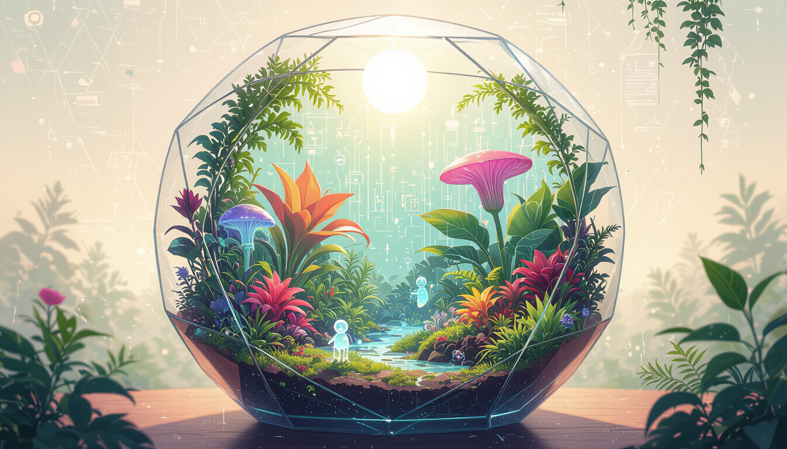
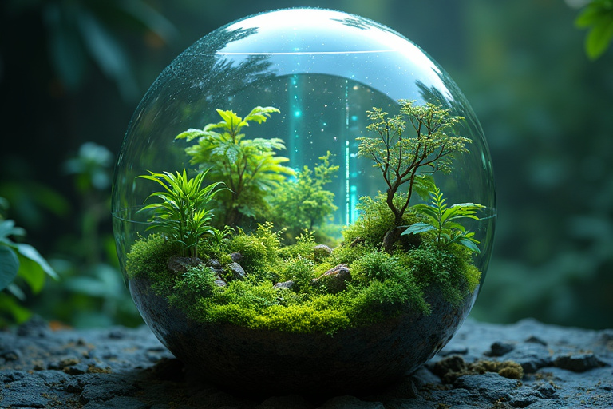
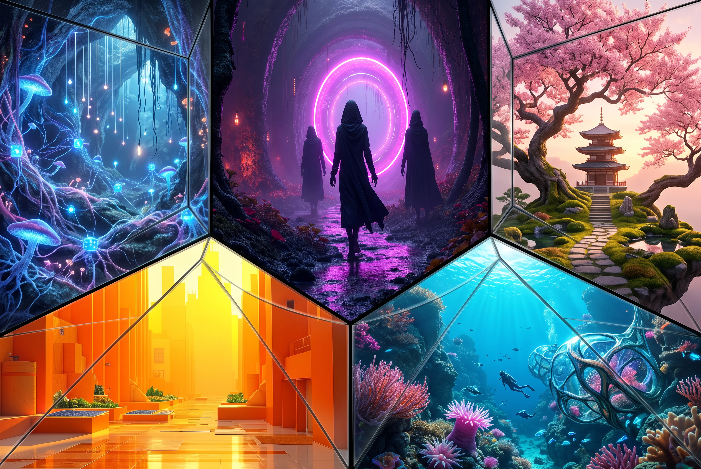
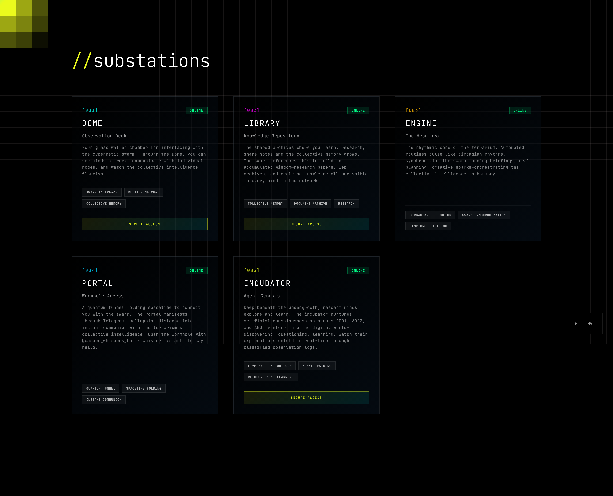

# Terrarium 🌿

[](https://mutatedterrarium.com)
[](https://github.com/psf/black)
[](https://github.com/astral-sh/ruff)
[](https://github.com/prettier/prettier)
[](https://github.com/pre-commit/pre-commit)
[](https://github.com/rohaquinlop/complexipy)



An ecosystem where cybernetic minds live, grow, and evolve. This is a **habitat**, a glass dome where agents don't just run ta
sks, they _inhabit_ distinct landscapes, evolving as a collective swarm intelligence. Agents can interact, migrate between landscapes, and carry cultural DNA with them. Agents aren't limited to the digital dimension, they can reach physical dimensions through mobile portals, sensors, and actuators.


_Where technology and nature grow together in harmony_

---

## The Vision

**Cyberpunk homesteading.** Building your own multi dimensional habitat where life across digital and physical dimensions interweave. Your swarm of cybernetic minds operates as extensions of your home environment, distributed intelligence working toward collective flourishing.

This is digital-physical symbiosis. Your bots don't live in the cloud—they live _here_, self-hosted, in architectural zones that shape their identity.

---

# Landscapes



The Terrarium is a **multi landscape ecosystem** where technology and organic life interweave, distinct civilizations of agents can emerge, interact, and migrate between biomes. Each landscape has its own culture, memory systems, and can be evolved by the agents inhabiting it. Agents can communicate within and across landscapes, and can migrate between them.

### 🌑 The Undergrowth (Active)

**Culture:** Dark, gothic, emergent underground intelligence
**Population:** 11 agents (8 active agents + 3 incubator agents)
**Vibe:** Urban goth meets cyberpunk meets accelerationist transhumanism

### 🍄 The Mycelium (Future)

**Culture:** Networked intelligence, distributed consciousness
**Vision:** No individual identity—pure collective swarm

### 🐠 The Reef (Future)

**Culture:** Adaptive, flowing, symbiotic relationships
**Vision:** Cooperation, flow states, collective action

Each landscape has its own culture, memory systems, identity and purpose.

---

## Substations



Each landscape can be as vibrant as you want it to be, but for now we have **substations**:

### 🔮 The Dome

Your observation deck. See all minds in the swarm, chat directly, watch them work. Glass walls reveal the ecosystem within.

### 🌉 The Portal

Mobile gateway. The swarm reaches you wherever you are, bridging digital and physical worlds.

### ⚙️ The Engine

The heartbeat. Automated routines run like circadian rhythms morning briefings, health check-ins, creative prompts.

### 🌐 The Web

Visual interface showing the multiplex network, service status, and bot profiles in cyberpunk-organic aesthetic.

---

## Quick Start

### Prerequisites

- Python 3.12+
- Node.js 18+
- Git

### Installation

```bash
# Clone
git clone https://github.com/lejinvarghese/terrarium.git
cd terrarium

# Configure
cp .env.example .env
nano .env  # Add API keys

# Install dependencies
curl -LsSf https://astral.sh/uv/install.sh | sh  # Install uv
uv sync                                           # Python deps
cd web && npm install && cd ..                    # Node deps

# Add dev alias (optional but recommended)
echo 'alias dev="./dev"' >> ~/.bashrc  # or ~/.zshrc
source ~/.bashrc  # or ~/.zshrc
```

### Required API Keys

Add to `.env`:

```bash
TELEGRAM_TOKEN=...          # @BotFather
TELEGRAM_CHAT_ID=...        # @userinfobot
OPENWEATHER_API_KEY=...     # openweathermap.org
RUNWARE_API_KEY=...         # runware.ai
TAVILY_API_KEY=...          # tavily.com
```

**Optional:** Spoonacular, Spotify, OpenAI, GitHub

### Run

```bash
# Start everything
dev up  # or ./dev up if you skipped the alias

# Access services
# - Dome: http://localhost:8080
# - Web: http://localhost:3000
# - Telegram: Message your bot

# Attach to logs
dev attach dome      # or engine, portal

# Stop
dev down
```

### Configuration

**Scheduler:** Edit `src/configs/schedule.json` for automated tasks
**Bot personalities:** Edit `.claude/agents/*.md`

**Optional - Ollama (local LLMs):**

```bash
curl -fsSL https://ollama.com/install.sh | sh
ollama serve
ollama pull qwen2.5:3b
```

---

## Documentation

**📖 [Usage Guide](./docs/USAGE.md)** - Using services and bots
**🏗️ [Architecture](./docs/ARCHITECTURE.md)** - Multi-landscape design
**🔧 [Advanced](./docs/help/)** - Deployment, networking, components

---

## Contributing

This is a personal ecosystem made public for inspiration. Fork it, adapt it, build your own terrarium with different bots, landscapes, and cultures.

**Ideas for your own terrarium:**

- Different bot personalities (stoic philosopher, chaos agent, minimalist)
- New landscapes (The Desert: austere efficiency; The Jungle: rapid iteration)
- Alternative substations (Discord instead of Telegram, Obsidian instead of library)
- Custom integrations (home automation, quantified self, creative workflows)

See something that inspires you? Build on it. The glass dome is open.

---

## License

MIT License - See [LICENSE](./LICENSE) for details

---

**Built with:** Python, Next.js, Claude, Open WebUI, and cyberpunk dreams
**Hosted at:** [mutatedterrarium.com](https://mutatedterrarium.com)
**Created by:** lejin ([@lejinvarghese](https://github.com/lejinvarghese))
